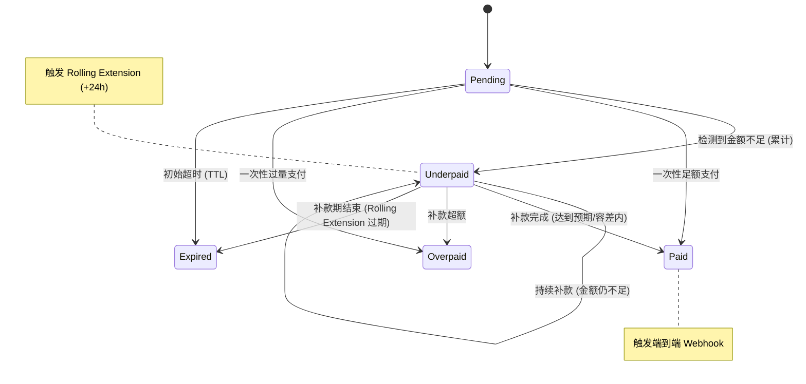
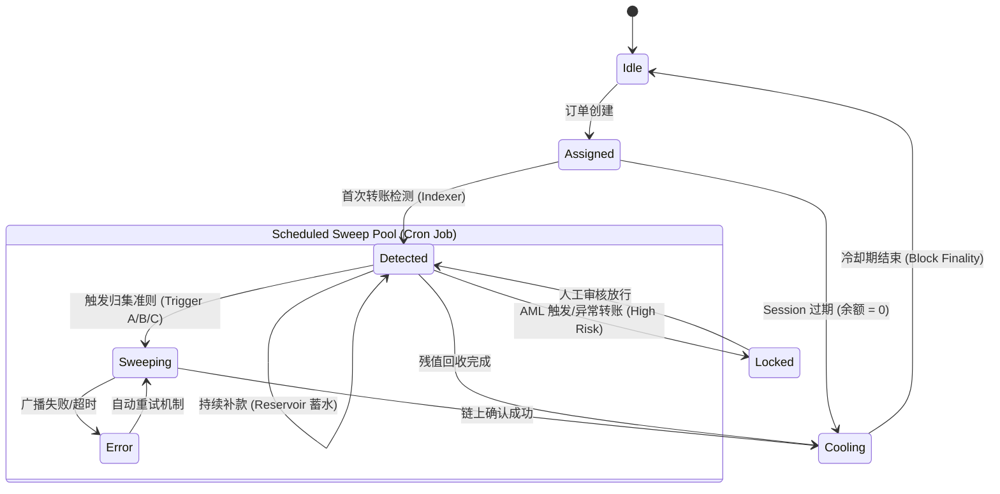

# 核心状态机设计 (State Machines)

> 📍 [返回架构目录](README.md)

---

## 1. Checkout Session 状态流 (Checkout Session State Flow)

针对区块链交易的异步性、不可撤回以及金额波动特性（如用户未扣除转账手续费导致的少付），系统对订单状态机进行了精细化模型设计。

### 1.1 状态定义

| 状态 | 类型 | 说明 |
| :--- | :--- | :--- |
| **Pending** | 初始态 | 订单已创建，等待用户发起支付。地址已锁定给该 Session。若已检测到交易但未达到确认数，UI 显示 **"Payment Detected"**。 |
| **Underpaid** | 中间态 | 已检测到支付，但累计金额 `amount_received < (amount_expected - tolerance)`。 |
| **Paid** | 终态 (成功) | 累计支付金额在容差范围内满足预期或完全吻合。触发业务发货。 |
| **Overpaid** | 终态 (成功) | 累计支付金额 `> amount_expected`。触发业务发货，超额部分记录报表。 |
| **Expired** | 终态 (失败) | 订单达到 TTL（含补款延期）后仍未收足款项。地址释放回池。 |
| **Blocked** | 终态 (风控) | AML 系统检测到高风险资金来源。资金被冻结，仅允许 `manual_transfer` 到商户收款地址。 |

### 1.2 状态流转图

### 1.3 详细业务逻辑说明

*   **移除 Cancelled 状态**：
    由于区块链交易一旦广播不可撤回，系统不再支持后端物理意义上的"取消"操作。前端"取消"仅由 Client 端切换 UI 状态，后端逻辑保持 `Pending` 直到自然过期，以防止用户在点击取消的同时完成支付导致的"状态竞争"错误。

*   **支付容差 (Tolerance) 逻辑**：
    系统通过配置 `underpayment_threshold`（如 0.1 USDT）来处理细微差额。
    - 若 `(amount_expected - amount_received) <= threshold`，系统自动将状态由 `Pending/Underpaid` 修正为 `Paid`。

*   **少付处理：中间态与滚动延期 (Underpaid & Rolling Extension)**：
    当检测到第一笔不足额付款（且由于容差判定失败）时，逻辑如下：
    1.  **保持地址分配**：严禁释放当前地址，必须支持用户向同一地址继续补款。
    2.  **累计支付 (Cumulative Payment)**：Indexer 会监听同一地址的所有进账，并计算 `Total Received`。
    3.  **滚动延期**：订单 `expires_at` 立即更新为 `now + 24 hours`（可配置），确保用户有充足时间处理交易所提现延迟或再次补款。

*   **多付处理 (Overpaid)**：
    若用户支付金额超过预期金额，系统应：
    1.  **视为支付成功**：立即触发 `Success` 回调，不得阻塞商户侧发货。
    2.  **自动归集**：Sweeper 仍将全额归集，但在 `transactions` 表中精确记录原始付款金额，供商户在财务报表中对账。

---

## 2. Address 状态流 (Address State Flow)

为了优化 Tron 网络高昂的归集成本（Gas Fee），系统将原有的"实时扫账"模式重构为"定时批量扫账（Scheduled Sweep）"模式。同时引入了 AML 风控熔断机制，确保商户主钱包的资金合规性。

### 2.1 状态定义

| 状态 | 类型 | 详细说明 |
| :--- | :--- | :--- |
| **Idle** | 初始态 | 空闲地址，可随时分配给新订单。 |
| **Assigned** | 锁定态 | 已分配给特定 Session，正在等待用户首次转账。 |
| **Detected** | 蓄水池 | **核心中间态**。已检测到链上余额。地址在此状态停留，支持多笔补款累计。 |
| **Locked** | 熔断态 | **AML 风控干预**。检测到高风险资金流入，地址被强行锁定，严禁 Sweeper 触碰。 |
| **Sweeping** | 活跃态 | 该地址已触发归集逻辑，正在进行 Gas 筹集或扫账交易广播。 |
| **Cooling** | 释放态 | 归集完成或零余额会话过期后进入短暂冷却期。仅当双 token 余额均为 0 时，冷却期满后才回到 Idle。 |
| **Error** | 异常态 | 归集过程发生非预期错误（如广播超限）。支持自动重试逻辑。 |

### 2.2 状态流转图 (Scheduled Sweep Logic)

### 2.3 核心流转逻辑详解

#### 从"瞬态"到"蓄水池 (Reservoir)"的变更
在 Account 模型（Tron/Ethereum）下，每发起一次扫账都会消耗固定的基准能量。为降低成本，系统禁止检测到余额后立即扫账。
- 地址进入 `Detected` 后将保持静默，允许用户在 `Underpaid` 状态下多次转账。
- Sweeper 会按预设频率（如每 10 分钟）批量扫描 `Detected` 池，寻找满足条件的地址。

#### AML 熔断机制 (Locked)
为防止沾染黑产资金（如来自被标记的中心化交易所非法地址或混币器）：
- **准则 A (订单结项)**：Session 状态为 `Paid` 或 `Overpaid`，立即归集全部余额。
- **准则 B (残值回收)**：Session 已过期 (`TTL Expired`) 且状态为 `Underpaid`。虽然订单失败，但用户转入的资产仍属于商户，需在 Gas 成本覆盖范围内回收。
- **准则 C (风险限额)**：地址累计余额超过大额阈值（如 > 2000 USDT）。为防止单地址集中风险，不论订单状态，优先触发强制归集。

#### 异常回路与自动重试
- **Error -> Sweeping**：对于因网络波动或 RPC 节点同步导致的失败，Sweeper 会增加 `attempts` 计数并在下个周期自动重新尝试。
- **Expired 清理**：若 Session 过期且其余额为 0（用户未支付），地址不得直接回收。必须流转至 `Cooling` 状态，等待链上交易确定性（Finality）确认后，再释放为 `Idle`，以防极端的 Re-org 导致地址被错误复用。
